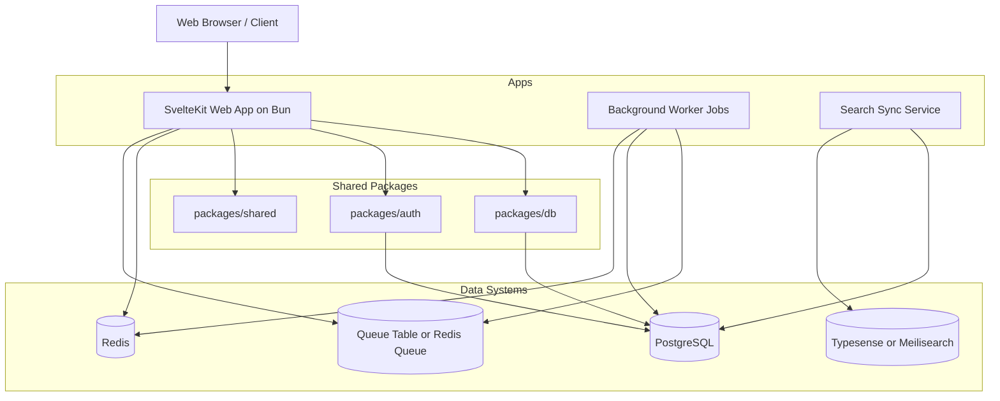

# Tech Deals Forum Architecture Plan

This document defines the production architecture for the Tech Deals Forum using SvelteKit, Bun, PostgreSQL, Drizzle ORM, Lucia Auth, Redis, and a dedicated search engine.

## 1. Architecture Goals

- SSR-first UX for fast, crawlable pages.
- Clear monorepo boundaries with shared contracts.
- Async-heavy write pipeline to keep user-facing latency low.
- Security-first session model with least privilege.
- Observable and operable stack for safe iteration.

## 2. High-Level System Architecture

## 3. Monorepo Layout

- apps/web: SvelteKit UI and server routes.
- services/worker: async jobs (score updates, notifications, cache invalidation).
- services/search-sync: indexing service for search documents.
- packages/db: Drizzle schema, migrations, typed queries.
- packages/auth: Lucia integration, session utilities, auth guards.
- packages/shared: validation schemas, common types, utility functions.
- infra/docker: compose manifests and container helper scripts.

## 4. Bounded Contexts

- Identity Context: users, auth methods, sessions, profile settings.
- Deals Context: deal entities, taxonomy, lifecycle states, pricing snapshots.
- Community Context: comments, votes, mentions, notifications.
- Moderation Context: reports, actions, policy outcomes, abuse signals.
- Commerce Context: affiliate rewrites, outbound clicks, conversion events.
- Discovery Context: search documents, filters, ranking and feed derivation.

This starts as a modular monolith inside the web app with explicit package boundaries; worker and search sync are separate deployables.

## 5. Core Data Model (Logical)

Primary entities:

- users, sessions, oauth_accounts
- categories, tags, merchants
- deals, deal_prices, deal_states
- deal_hardware_specs (normalized CPU, CPU architecture, GPU, RAM, storage, display attributes)
- votes, comments, comment_votes
- saved_deals, alerts, notifications
- moderation_reports, moderation_actions
- affiliate_clicks, conversion_events
- search_documents (derived projection)

Key invariants:

- One active vote per user per deal.
- Hardware attributes are normalized and validated against category-specific schema rules.
- Comment tree supports nested replies with depth constraints.
- Deal state transitions are auditable.
- Affiliate rewrite mapping is deterministic and reversible for audit.

## 6. Request and Write Patterns

### 6.1 Read Path

- SvelteKit server load functions fetch data from PostgreSQL.
- Redis caches hot feed fragments and filter aggregates.
- Search engine handles deep faceted filtering and ranked search.

### 6.2 Write Path

- Form actions and API endpoints validate inputs with shared schemas.
- Writes are persisted via Drizzle transactions.
- Post-commit events enqueue async jobs for:
  - score recomputation,
  - cache invalidation,
  - notification fan-out,
  - search index updates.

### 6.3 Consistency Model

- Strong consistency for identity, voting constraints, and moderation actions.
- Eventual consistency for feed ranking and search index projection.

## 7. Authentication and Authorization

- Lucia cookie-based sessions stored in PostgreSQL.
- Session checks in hooks.server.ts populate request locals.
- Role model: guest, user, trusted-user, moderator, admin.
- Route and action guards enforce role and ownership rules.
- CSRF protections on form actions and strict cookie flags.

## 8. Security Architecture

- Input validation at edge and server action boundaries.
- Rate limiting on auth, deal post, vote, and report endpoints.
- Anti-spam controls with reputation thresholds and cooldown windows.
- Content sanitization for rich text fields.
- Secrets via environment injection and zero hardcoded credentials.
- Audit logging for moderation and sensitive admin actions.

## 9. Caching and Ranking

- Redis key strategy:
  - feed:hot:{window}:{page}
  - feed:new:{page}
  - deal:{id}:summary
  - filters:{category}:{hash}
- Invalidation triggers:
  - deal create/update/state change,
  - vote delta,
  - moderation action,
  - periodic scheduled freshness sweeps.
- Hot score combines vote velocity, net score, comment activity, and decay.

## 10. Search Architecture

- Search projection schema includes:
  - title, merchant, category, tags,
  - normalized price fields,
  - spec facets (CPU, CPU architecture, GPU, RAM, storage, screen size, resolution, refresh rate, panel type, and category-specific fields),
  - state and freshness metadata.
- Indexing flow:
  - deal changes emit indexing jobs,
  - search-sync consumes jobs idempotently,
  - failed jobs are retried with dead-letter capture.

## 11. Observability and Operations

- Structured logs with request IDs.
- Metrics:
  - p50/p95 page response,
  - database latency,
  - cache hit ratio,
  - queue lag,
  - search indexing lag,
  - auth failure rates.
- Tracing for critical flows: signup, submit deal, vote, moderation.
- Alerting on latency spikes, error-rate thresholds, and queue backlogs.

## 12. Non-Functional Targets

- Availability: target 99.9% for user-facing web tier after launch stabilization.
- Performance:
  - homepage SSR p95 under 800ms in production baseline regions,
  - deal detail SSR p95 under 900ms,
  - vote write path p95 under 250ms.
- Accessibility: WCAG 2.1 AA for primary journeys.
- Scalability: horizontal web scaling with stateless app nodes.

## 13. Build and Local Orchestration

Root scripts:

- dev, build, test, test:e2e, lint
- db:migrate, db:seed
- compose:up, compose:down

Docker Compose services:

- postgres
- redis
- search
- optional web and worker containers

Compose health checks must gate test startup.

## 14. Deployment Topology

- Web app: stateless containers behind load balancer.
- Worker and search-sync: separate autoscaled process groups.
- PostgreSQL: managed instance with backups and point-in-time restore.
- Redis: managed cache with persistence mode selected by SLO.
- Search: managed or containerized cluster based on budget and scale.

## 15. Architecture Risks and Mitigations

- Risk: search/document drift.
  - Mitigation: idempotent sync, lag metrics, periodic reconciliation jobs.
- Risk: vote abuse and brigading.
  - Mitigation: rate limits, anomaly detection, moderation tools.
- Risk: cache inconsistency.
  - Mitigation: event-driven invalidation plus periodic full refresh jobs.
- Risk: schema migration breakage.
  - Mitigation: forward-compatible migrations and rollback playbooks.

## 16. ADR Backlog

Create ADRs for:

- Search engine selection (Typesense vs Meilisearch).
- Queue implementation (DB queue vs Redis queue).
- Rich text strategy and sanitization model.
- Hot ranking formula and anti-gaming policies.
- Deployment target (single cloud vs hybrid).

## 17. Request Lifecycle Examples

### 17.1 Homepage View

1. Client requests /.
2. hooks.server.ts resolves session and user role.
3. Server load checks Redis hot feed cache.
4. Cache miss triggers PostgreSQL query + score projection.
5. Response is SSR-rendered with SEO metadata and cache warm-up.

### 17.2 Vote Submission

1. Authenticated user submits vote on deal.
2. Endpoint validates auth and anti-abuse limits.
3. Transaction upserts vote row and updates aggregate counters.
4. Event enqueues score recalculation and cache invalidation.
5. Client gets updated score state optimistically confirmed by server.
