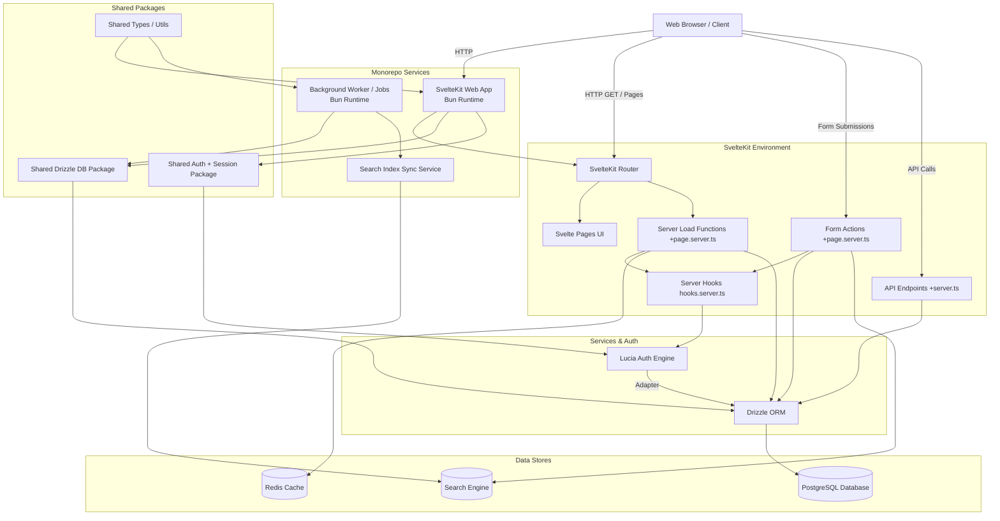

# Tech Deals Forum Architecture Plan

This document describes the high-level architecture and system design for the Tech Deals Forum, aligning with the planned implementation stack of SvelteKit, Bun, PostgreSQL, Drizzle ORM, and Lucia Auth. The system will be organized as a monorepo that contains the web application, supporting services, shared packages, and local infrastructure definitions.

## 1. High-Level System Architecture

The application follows an SSR-first full-stack architecture centered around a SvelteKit web app, but it will be implemented as a monorepo so the web tier, background services, and shared code can evolve together with one build and test surface.

## 1.1 Monorepo Layout

The repository should be structured so all application code and supporting infrastructure are versioned together:

- `apps/web`: SvelteKit frontend and server-rendered web application.
- `services/worker`: background jobs for cache invalidation, score recalculation, and async indexing.
- `services/search-sync`: service or job handlers that mirror deals into the search engine.
- `packages/db`: Drizzle schema, migrations, seed logic, and database helpers.
- `packages/auth`: Lucia configuration, session helpers, and auth guards.
- `packages/ui` or `packages/shared`: shared types, validation schemas, and reusable utilities.
- `infra/docker`: Dockerfiles, Compose fragments if needed, and local bootstrapping assets.

This layout keeps all services in one workspace while preserving clear boundaries between deployable units and reusable packages.

## 2. Component Layers & Responsibilities

### 2.1 The Client Layer (Frontend)
- **Framework:** Svelte components styled with plain Tailwind CSS.
- **Role:** Render UI sent from the server, handle client-side interactivity (like upvoting or expanding comment trees), and submit data via progressive enhancement (SvelteKit Form Actions).
- **SEO/Metadata:** Fully server-side rendered for SEO crawling and rich OpenGraph cards when deals are shared on social media.

### 2.2 The Web Server Layer (SvelteKit on Bun)
- **Runtime:** Bun provides an ultra-fast JavaScript execution environment, bypassing Node.js overhead.
- **Hooks (`hooks.server.ts`):** 
  - Intercepts all incoming requests explicitly.
  - Validates the session cookie via Lucia Auth.
  - Injects `user` and `session` objects into `event.locals` for downstream use in load functions and actions.
- **Load Functions (`+page.server.ts`):** Fetches deal data, user profiles, and comments from the database before the page renders. Relies heavily on Drizzle ORM queries.
- **Form Actions (`+page.server.ts`):** Replaces traditional REST APIs for form submissions. When a user submits a deal or posts a comment, standard `FormData` is sent to these actions, validated, and inserted into the database via Drizzle.

### 2.3 Background Services
- **Worker Service:** Handles async jobs that should not block user requests, including feed cache refreshes, score recomputation, webhook processing, and outbound notification delivery.
- **Search Sync Service:** Updates search indexes after deal writes or moderation changes so the web app does not need to synchronously manage search consistency during request handling.
- **Shared Contracts:** Both services consume shared validation schemas and database access code from workspace packages to avoid drift.

### 2.4 The Authentication Layer (Lucia Auth)
- **Session Strategy:** Cookie-based session tracking mapped directly to the database. No JWTs.
- **Workflow:**
  1. User authenticates via credentials or OAuth (e.g., Google/Discord).
  2. Lucia creates a robust session record in PostgreSQL (via the Drizzle adapter).
  3. A secure HTTP-only cookie containing the session ID is passed to the browser.
  4. Subsequent requests are validated against the database session table via `hooks.server.ts`.

### 2.5 The Data Access Layer (Drizzle ORM & PostgreSQL)
- **Relational Model:** Core mapping of `users`, `sessions`, `deals`, `votes`, `comments`, and `categories`.
- **Reasoning for Drizzle:** Drizzle ensures zero-dependency TypeScript safety and high performance on the edge/Bun runtime. It generates extremely efficient SQL tailored for the underlying PostgreSQL adapter (e.g., `postgres.js`).

### 2.6 Caching & Search Extensions
- **Caching (Redis):** High-traffic feeds (e.g., the front page "Hot Deals") are cached in Redis to prevent excessive database hits. Cache invalidation can be triggered by the worker after writes or moderation events.
- **Search (Typesense/Meilisearch/Algolia):** While basic queries hit Postgres, deep filtering (e.g., matching a laptop by specific RAM size, GPU series, and price) is offloaded to a dedicated search engine. Search indexing is handled asynchronously by the search sync service.

## 3. Build, Test, and Local Full-Stack Orchestration

The monorepo should provide a single entry point for developers to build and validate the full stack locally.

### 3.1 Root Workspace Scripts
- `dev`: starts the web app and any required local worker processes.
- `build`: builds all apps and services in dependency order.
- `test`: runs unit and integration tests across packages and services.
- `test:e2e`: runs browser and full-stack end-to-end coverage against the local Compose environment.
- `lint`: validates TypeScript, Svelte, and formatting rules across the workspace.
- `db:migrate` and `db:seed`: manage schema changes and seed local data from the root.
- `compose:up` and `compose:down`: boot and stop the local infrastructure stack.

These scripts should live in the root package manifest and delegate into workspace packages so local development and CI use the same commands.

### 3.2 Docker Compose for Local Development
- Provide a root `docker-compose.yml` that boots PostgreSQL, Redis, the chosen search engine, and optionally the app and worker containers.
- Support both workflows: infra-only Compose for fast local iteration, and full-stack Compose for clean-room verification.
- Mount source code or use dedicated Dockerfiles so the stack can be built and tested locally without external hosted dependencies.
- Include health checks and dependency ordering so integration tests can wait for PostgreSQL, Redis, and search to become ready.

### 3.3 Local Verification Goals
- A new developer should be able to clone the monorepo, run the install command once, start Docker Compose, and execute a single root test command.
- CI should reuse the same root scripts and Compose definitions to reduce drift between local and automated environments.

## 4. Request Lifecycle Examples

### 4.1 Viewing the Homepage (GET)
1. User requests `/`.
2. `hooks.server.ts` intercepts, checks cookies, and sets `event.locals.user` to null (guest) or the user profile.
3. `+page.server.ts` Server Load function executes.
4. It queries Redis for the "Hot Deals" feed snippet. If a cache miss occurs, Drizzle queries PostgreSQL, calculates scores, and caches the result.
5. The Svelte page is compiled to HTML using the loaded data and sent to the client.

### 4.2 Upvoting a Deal (POST)
1. Authenticated user clicks "Upvote" on `/deals/123`.
2. A client-side fetch request or progressively enhanced form submits to `/deals/123/vote/+server.ts` (or form action).
3. Server validates authentication in `event.locals`.
4. Drizzle ORM executes an `UPSERT` into the `votes` table to ensure one vote per user per deal.
5. A background task or database trigger recalculates the deal's hotness score based on time decay. 
6. Server responds with the updated deal score to immediately reflect on the client UI.
